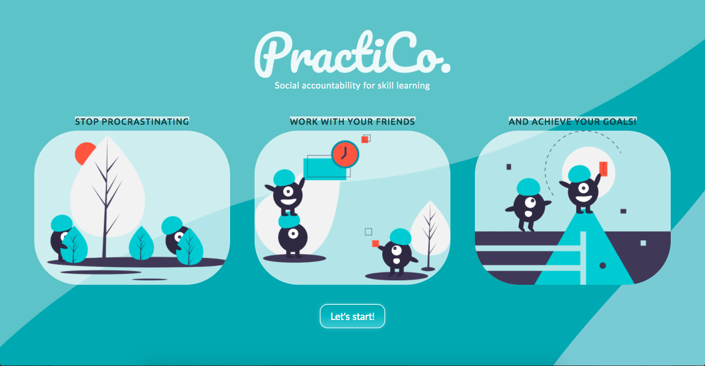
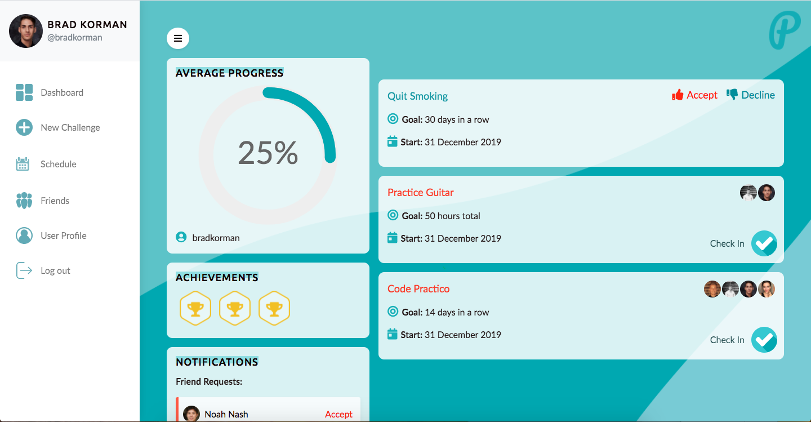
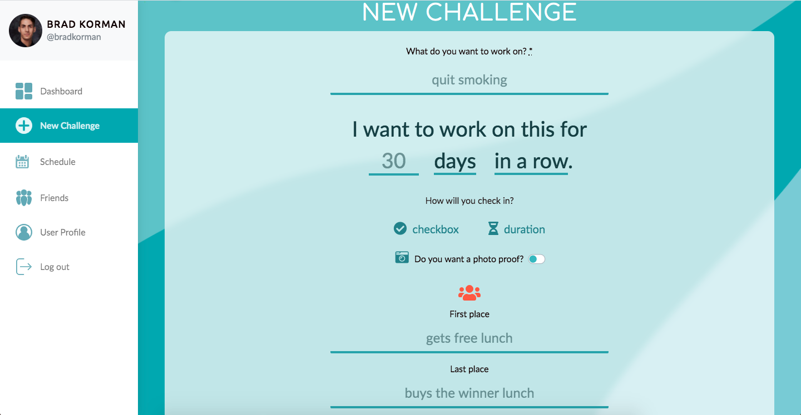
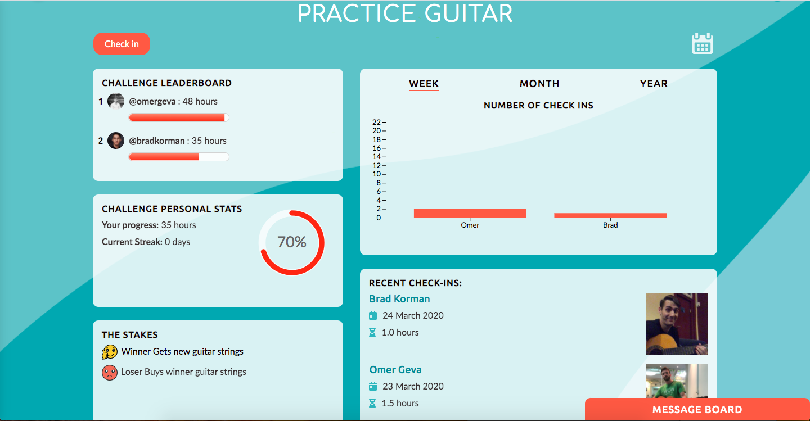
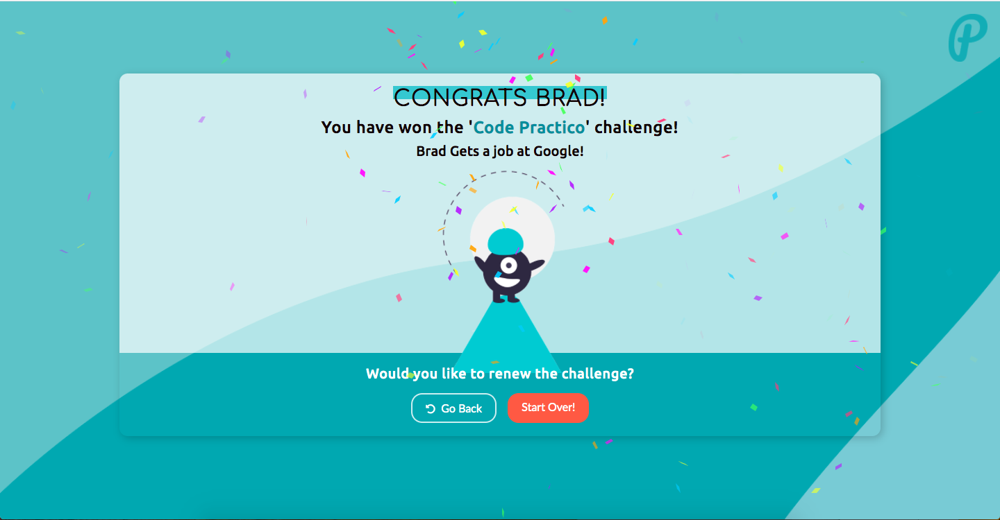

# PractiCo.

  

PractiCo. is the productivity app that let's you turn personal development goals
into challenges that you can work on with your friends. Stop procrastinating with
social accountability.

View it live: (https://elpracti.co)

Watch the demo: (https://youtu.be/Toe2ColbDco?t=3317)

  

Create an account and start a new challenge, including the skill you want to learn
and your practice goals, then invite your friends to participate in the challenge.

  

You can measure challenges by the day, hour, or week, and by total time or in a row.
For example you can quit smoking for 30 days in a row, or practice guitar for 30 hours
total.

You can check in either by setting a timer for a practice session or with a checkbox
to confirm you worked toward your goal that day. You can even upload a photo of yourself
after a practice to track your progress.

  

Best of all you can invite your friends to join the challenge and set the stakes
for the challenge, and even chat with them in-app.

Celebrate your victories!!

  

# Technology Used

# Keywords
Self help, Artificial Intelligence, Data Science, Neural Networks, Applied Mathematics, Cognitive Behavioral Therapy (CBT), Mental Health First Aid, Columbia University.

# Our team
    Omer Geva

    Brad Korman

    Alisa Silina

    Dean Wheeler
